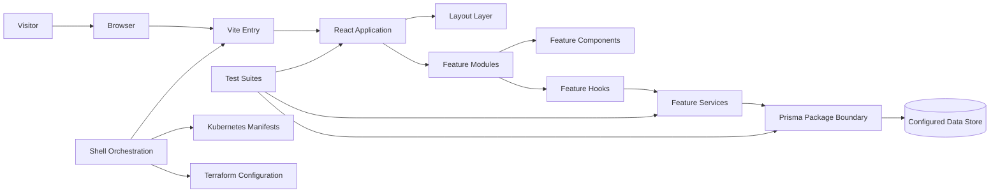
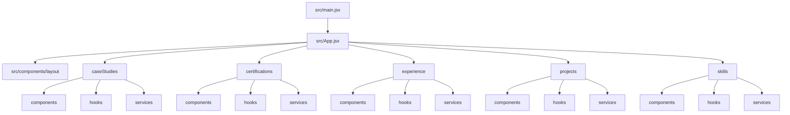
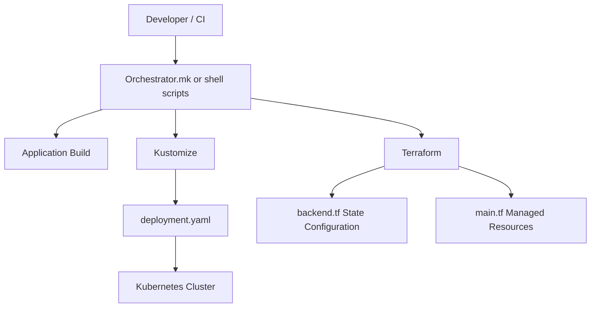
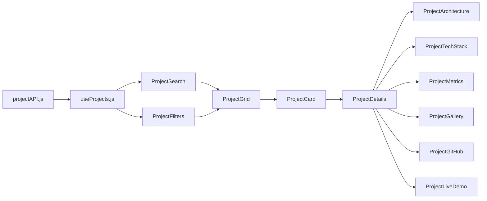
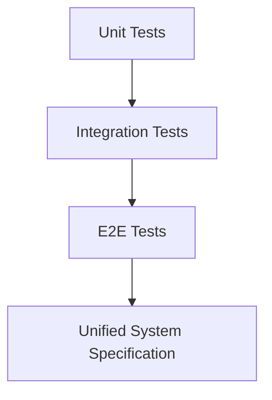
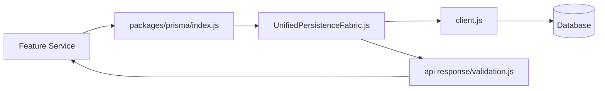

<div align="center">

# Portfolio Engineering Platform

### A feature-oriented React portfolio with explicit persistence, automation, testing, and infrastructure boundaries

[](https://react.dev/)
[](https://vite.dev/)
[](https://developer.mozilla.org/docs/Web/JavaScript)
[](https://www.typescriptlang.org/)
[](https://www.prisma.io/)
[](https://kubernetes.io/)
[](https://www.terraform.io/)
[](https://github.com/shakib-mia765/Portfolio)

**Portfolio UI · Feature Modules · Reusable Components · Custom Hooks · Service Boundaries · Prisma Access · Test Layers · Deployment Automation**

[Architecture](#architecture) · [Repository Map](#repository-map) · [Getting Started](#getting-started) · [Engineering Guide](#engineering-guide) · [Infrastructure](#infrastructure) · [Testing](#testing-strategy)

</div>

---

## Executive Summary

This repository is a portfolio application organized as an engineering system rather than a collection of disconnected pages. The frontend is powered by React and Vite, while the codebase separates product features, reusable interface primitives, application layout, persistence access, operational scripts, tests, and infrastructure declarations.

The repository is intentionally structured around five portfolio domains:

- **Case Studies** — problem framing, architectural decisions, trade-offs, scaling strategy, and lessons learned.
- **Certifications** — credential presentation, verification, details, and derived skills.
- **Experience** — roles, achievements, impact metrics, technology usage, and timeline presentation.
- **Projects** — discovery, filtering, project detail, architecture, metrics, source links, and live demos.
- **Skills** — skills taxonomy, progress, learning history, graphing, and technology visualization.

The core architectural goal is straightforward:

> Keep UI composition close to the feature that owns it, keep reusable primitives independent, keep data access behind service boundaries, and keep deployment concerns outside application code.

---

## Engineering Principles

| Principle | Repository interpretation |
|---|---|
| **Feature ownership** | Each business-facing portfolio area owns its components, hooks, services, and page entry point. |
| **Separation of concerns** | UI, stateful hooks, data services, persistence, automation, testing, and infrastructure live in explicit boundaries. |
| **Progressive complexity** | A simple page may render directly, while operational engine components can coordinate richer behavior without polluting primitives. |
| **Stable public surfaces** | Feature pages and package indexes provide predictable entry points for consumers. |
| **Testability** | Unit, integration, end-to-end, and system-level specifications are represented as separate testing layers. |
| **Operational clarity** | Setup, seed, deployment, orchestration, Kubernetes, and Terraform concerns are represented explicitly. |
| **Truthful documentation** | This README documents the repository that exists; it does not claim services, frameworks, benchmarks, or scale that are not evidenced by the codebase. |

---

## Architecture

### System Context



### Frontend Composition



### Dependency Direction

```text
Application Entry
       │
       ▼
Feature Pages ───────────────► Layout Components
       │
       ├────────► Feature Components
       │
       ├────────► Feature Hooks
       │                 │
       │                 ▼
       └────────► Feature Services
                         │
                         ▼
                Persistence Boundary
```

The desired dependency direction is inward toward stable contracts:

1. Pages compose feature behavior.
2. Feature components render data and interaction surfaces.
3. Hooks coordinate state, effects, debouncing, streaming, and derived values.
4. Services isolate networking, caching, validation, telemetry, and registry concerns.
5. The Prisma package centralizes persistence-facing exports.
6. Infrastructure and scripts operate around the application rather than being imported into UI runtime code.

---

## Repository Map

The following tree preserves the repository structure and naming supplied for this project.

```text
Portfolio/
│
├── .github/
│   └── workflows/
│       ├── ci.yml
│       ├── cd.yml
│       ├── security-scan.yml
│       └── lighthouse.yml
│
├── infra/
│   ├── k8s/
│   │   ├── deployment.yaml
│   │   └── kustomization.yaml
│   │
│   ├── terraform/
│   │   ├── backend.tf
│   │   └── main.tf
│   │
│   └── Orchestrator.mk
│
├── packages/
│   └── prisma/
│       ├── api response/
│       │   ├── index.js
│       │   └── validation.js
│       │
│       ├── UnifiedPersistenceFabric.js
│       ├── client.js
│       └── index.js
│
├── public/
│   ├── favicon.svg
│   └── icons.svg
│
├── scripts/
│   ├── apex-orchestrator.sh
│   ├── deploy.sh
│   ├── seed.ts
│   └── setup.sh
│
├── src/
│   ├── assets/
│   │   ├── hero.png
│   │   ├── react.svg
│   │   └── vite.svg
│   │
│   ├── components/
│   │
│   ├── features/
│   │   ├── caseStudies/
│   │   ├── certifications/
│   │   ├── experience/
│   │   ├── projects/
│   │   └── skills/
│   │
│   ├── layout/
│   │   ├── footer.jsx
│   │   ├── navbar.jsx
│   │   ├── sidebar.jsx
│   │   └── layout-kernel-injector.sh
│   │
│   ├── ui/
│   │   ├── button.jsx
│   │   ├── card.jsx
│   │   ├── contact.jsx
│   │   ├── dialog.jsx
│   │   └── input.jsx
│   │
│   ├── DockerFile
│   ├── next.config.js
│   ├── server.js
│   ├── tsconfig.json
│   ├── workspace-core-injector.sh
│   ├── App.css
│   ├── App.jsx
│   ├── index.css
│   └── main.jsx
│
├── tests/
│   ├── e2e/
│   │   ├── AuthenticationMocks.ts
│   │   └── playwright.config.js
│   │
│   ├── integration/
│   │   ├── NodeExpressIngress.spec.ts
│   │   ├── PostgresConnectionPool.spec.ts
│   │   └── PrismaInfraPipeline.spec.ts
│   │
│   ├── unit/
│   │   ├── ReduxGlobalSlices.test.ts
│   │   └── RegistryIngress.test.js
│   │
│   └── UnifiedEnterpriseCluster.spec.ts
│
├── .docker-compose.yml
├── .env.example.js
├── .gitignore
├── .oxlintrc.json
├── .pnpm-workspace.yaml
├── .turbo.json
├── CaseStudyDetails.jsx
├── README.md
├── index.html
├── package-lock.json
├── package.json
└── vite.config.js
```

> **Naming note:** The tree above is documented exactly as supplied. Paths containing spaces, such as `packages/prisma/api response/`, must always be quoted in shell commands. The existing filename `DockerFile` is case-sensitive on Linux.

---

## Architectural Layers

### 1. Application Bootstrap

| File | Responsibility |
|---|---|
| `index.html` | Browser document and Vite mount target. |
| `src/main.jsx` | React runtime bootstrap and root rendering boundary. |
| `src/App.jsx` | Top-level application composition. |
| `src/App.css` | Application-scoped styling. |
| `src/index.css` | Global reset, tokens, and shared base rules. |
| `vite.config.js` | Build and development-server configuration. |

The bootstrap layer should remain thin. It should initialize the React tree, import global styles, and delegate product behavior to feature and layout modules.

### 2. Feature Modules

Each feature follows a vertical-slice pattern:

```text
feature/
├── components/   # Presentational and feature-specific UI
├── hooks/        # Stateful orchestration and reusable behavior
├── services/     # I/O, data transformation, caching, telemetry, validation
├── *Engine.jsx   # Optional high-complexity coordinator
└── *Page.jsx     # Public page-level composition boundary
```

This design minimizes cross-feature coupling. A change to project filtering should remain inside `projects/`; a change to certificate verification should remain inside `certifications/`.

### 3. Layout Layer

`src/components/layout/` contains the application shell:

- `navbar.jsx` — primary navigation.
- `sidebar.jsx` — secondary or contextual navigation.
- `footer.jsx` — closing navigation, identity, and supporting links.
- `layout-kernel-injector.sh` — repository automation associated with the layout boundary.

Layout components may compose shared UI primitives, but they should not own feature data access.

### 4. UI Primitives

`src/components/ui/` contains reusable interface elements:

- Card surfaces
- Dialog behavior
- Input controls
- Contact presentation
- Shared button primitive at `src/components/button.jsx`

A UI primitive should be domain-agnostic. For example, a card may accept project data, certification data, or experience data without importing any of those feature modules itself.

### 5. Persistence Package

`packages/prisma/` acts as a persistence-facing package boundary:

| Path | Role |
|---|---|
| `client.js` | Prisma client creation and lifecycle access. |
| `index.js` | Package export surface. |
| `UnifiedPersistenceFabric.js` | Higher-level persistence coordination or abstraction. |
| `api response/index.js` | Persistence/API response helpers. |
| `api response/validation.js` | Validation rules for persistence-facing responses. |

Recommended dependency rule:

```text
Feature Service → packages/prisma/index.js → client.js
```

Consumers should prefer package exports over importing implementation internals directly.

### 6. Automation Layer

| Script | Intended responsibility |
|---|---|
| `scripts/setup.sh` | Local environment preparation and dependency setup. |
| `scripts/seed.ts` | Deterministic development/test data seeding. |
| `scripts/deploy.sh` | Deployment execution. |
| `scripts/apex-orchestrator.sh` | High-level orchestration across setup, seed, build, and deployment tasks. |
| `infra/Orchestrator.mk` | Make-based operational command surface. |

Scripts should be non-interactive where practical, fail fast, and return non-zero exit codes on failure.

### 7. Infrastructure Layer



Infrastructure definitions are kept under `infra/` to prevent deployment mechanics from leaking into frontend modules.

---

## Feature Catalog

### Case Studies

The case-study domain communicates engineering judgment, not only final screenshots.

| Capability | Component |
|---|---|
| Problem framing | `ProblemStatement.jsx` |
| Solution narrative | `SolutionOverview.jsx` |
| Architecture explanation | `ArchitectureBreakdown.jsx` |
| Trade-off communication | `TradeOffAnalysis.jsx` |
| Scaling plan | `ScalingStrategy.jsx` |
| Retrospective learning | `LessonsLearned.jsx` |
| Summary presentation | `CaseStudyCard.jsx` |
| Detailed presentation | `CaseStudyDetails.jsx` |

The hooks and services add asynchronous flow, debounced state, event streaming, API access, caching, and telemetry boundaries.

### Certifications

This module treats certifications as verifiable evidence rather than decorative logos.

- `CertificateViewer.jsx` presents certificate artifacts.
- `VerificationLink.jsx` exposes verification paths.
- `CertificationDetails.jsx` provides credential context.
- `SkillsFromCertification.jsx` maps credentials to demonstrated capabilities.
- `certification.manifest.json` provides a data-oriented manifest boundary.

### Experience

The experience domain separates role context from measurable outcomes:

- Role description
- Achievements
- Impact metrics
- Technology usage
- Chronological timeline
- Filtering and retrieval behavior
- Telemetry around experience interactions

### Projects

The projects domain has the broadest discovery surface:



### Skills

The skills domain supports multiple representations of capability:

- Category grouping
- Individual skill cards
- Progress representation
- Learning timeline
- Graph-based relationships
- Technology-stack visualization
- Registry and schema validation services
- Prisma profiling hook boundary

---

## Technology Surface

| Area | Repository technology |
|---|---|
| UI runtime | React |
| Build tool | Vite |
| Primary language | JavaScript / JSX |
| Supporting language | TypeScript in scripts and tests |
| Linting | Oxlint configuration |
| Persistence boundary | Prisma-oriented package |
| E2E configuration | Playwright configuration |
| Container orchestration descriptor | Docker Compose file |
| Cluster deployment | Kubernetes + Kustomize |
| Infrastructure as Code | Terraform / HCL |
| Automation | POSIX-style shell scripts + Make |
| Workspace metadata | PNPM workspace and Turbo configuration files |

The root `package.json` in the repository currently exposes Vite development, production build, lint, and preview commands. Dependency and script documentation should be updated whenever that file changes.

---

## Getting Started

### Prerequisites

Use versions compatible with the repository lockfile and package manifest.

- Node.js
- npm
- Git
- Docker, only for container workflows
- kubectl and Kustomize, only for Kubernetes workflows
- Terraform, only for infrastructure provisioning

### Clone

```bash
git clone https://github.com/shakib-mia765/Portfolio.git
cd Portfolio
```

### Install

The repository includes `package-lock.json`, so the deterministic npm installation path is:

```bash
npm ci
```

For local dependency experimentation, use:

```bash
npm install
```

### Run the Development Server

```bash
npm run dev
```

Vite prints the local development URL after startup.

### Create a Production Build

```bash
npm run build
```

### Preview the Production Build

```bash
npm run preview
```

### Run Static Analysis

```bash
npm run lint
```

---

## Environment Configuration

The repository contains `.env.example.js`. Treat it as a template and never commit real credentials.

A safe workflow is:

```bash
cp .env.example.js .env.local
```

Then replace placeholder values locally.

### Environment Rules

1. Public browser variables must use the Vite-approved prefix expected by the application.
2. Database URLs, tokens, and private keys must never be embedded in frontend bundles.
3. Production secrets should come from the deployment platform or Kubernetes Secrets.
4. Test configuration should use isolated resources and must not point at production data.
5. Logs must avoid printing credentials or full connection strings.

---

## Command Surface

### Root Commands

| Command | Purpose |
|---|---|
| `npm run dev` | Start Vite in development mode. |
| `npm run build` | Generate the production bundle. |
| `npm run lint` | Run Oxlint. |
| `npm run preview` | Serve the production bundle locally for verification. |

### Operational Scripts

Run shell scripts only after reviewing their environment assumptions:

```bash
chmod +x scripts/setup.sh scripts/deploy.sh scripts/apex-orchestrator.sh
```

Examples:

```bash
./scripts/setup.sh
./scripts/apex-orchestrator.sh
./scripts/deploy.sh
```

Because script interfaces can evolve, use the script source as the authoritative command contract.

---

## Testing Strategy

The test topology separates fast feedback from broader system confidence.



### Unit Tests

Located in `tests/unit/`:

- `ReduxGlobalSlices.test.ts`
- `RegistryIngress.test.js`

Unit tests should remain deterministic, fast, and independent of real external services.

### Integration Tests

Located in `tests/integration/`:

- `NodeExpressIngress.spec.ts`
- `PostgresConnectionPool.spec.ts`
- `PrismaInfraPipeline.spec.ts`

Integration tests validate boundaries between modules, runtime ingress, connection management, and persistence infrastructure.

### End-to-End Tests

Located in `tests/e2e/`:

- `AuthenticationMocks.ts`
- `playwright.config.js`

E2E scenarios should test user-visible behavior through the browser and isolate authentication through explicit fixtures or mocks.

### Unified System Specification

`tests/UnifiedEnterpriseCluster.spec.ts` is the repository-level system specification boundary. It should coordinate high-level behavior without duplicating every lower-level assertion.

### Quality Gate

A production change should ideally pass:

```text
Install → Lint → Unit → Integration → E2E → Build
```

Only commands actually configured in `package.json` or the relevant test runner configuration should be used in CI.

---

## Persistence Design

### Client Lifecycle

A Prisma client should be created through `packages/prisma/client.js` and exported through the package boundary. Application modules should avoid creating independent clients, which can lead to unnecessary connection pools during development or hot reload.

### Validation Boundary

`packages/prisma/api response/validation.js` should validate data crossing persistence or API boundaries. Validation should occur before data is rendered or trusted by downstream feature modules.

### Seeding

`scripts/seed.ts` should be:

- deterministic;
- repeatable;
- safe to run more than once where possible;
- explicit about the target environment;
- prohibited from mutating production data without an intentional override.

### Persistence Flow



---

## Infrastructure

### Kubernetes

`infra/k8s/deployment.yaml` defines the workload deployment contract. `infra/k8s/kustomization.yaml` provides the Kustomize entry point.

Inspect the rendered manifest before applying it:

```bash
kubectl kustomize infra/k8s
```

Apply only after review:

```bash
kubectl apply -k infra/k8s
```

Recommended production controls include:

- readiness and liveness probes;
- explicit resource requests and limits;
- immutable image tags;
- non-root execution;
- read-only root filesystem where possible;
- secret injection outside source control;
- rolling deployment strategy;
- namespace and service-account isolation.

### Terraform

`infra/terraform/backend.tf` defines state-backend behavior, while `infra/terraform/main.tf` defines infrastructure resources and provider-facing configuration.

Safe workflow:

```bash
cd infra/terraform
terraform fmt -check
terraform init
terraform validate
terraform plan
```

Apply only after the plan has been reviewed:

```bash
terraform apply
```

Never commit local state, state backups, generated plans containing secrets, or provider credentials.

### Docker Compose

The root `.docker-compose.yml` is the repository’s Compose descriptor. Validate it before use:

```bash
docker compose -f .docker-compose.yml config
```

Then run the declared services:

```bash
docker compose -f .docker-compose.yml up --build
```

---

## Security Model

This portfolio is public-facing, so security quality matters even when the application is primarily presentational.

### Required Controls

- Escape and validate untrusted data before rendering.
- Use `rel="noopener noreferrer"` for external links opened in a new tab.
- Restrict allowed URL protocols for project, certificate, demo, and GitHub links.
- Keep secrets out of Vite client variables.
- Pin and audit dependencies.
- Run containers as non-root where possible.
- Avoid shell scripts that interpolate untrusted values without quoting.
- Keep Terraform state in a protected backend.
- Use Kubernetes Secrets or an external secret manager for sensitive values.
- Avoid logging personal or credential data in telemetry services.

### Dependency Review

```bash
npm audit
npm outdated
```

An audit finding is not automatically exploitable, but every production-relevant finding should be triaged and documented.

---

## Performance Strategy

### Frontend

- Keep page-level orchestration separate from presentational components.
- Debounce expensive search and filtering operations.
- Virtualize large certification or project lists when needed.
- Lazy-load heavy detail views and media.
- Use responsive image dimensions and modern formats.
- Prevent avoidable rerenders with stable props and derived state.
- Keep telemetry outside render-critical paths.
- Measure before introducing memoization or caching.

### Data and Services

- Cache immutable or slow-changing portfolio data deliberately.
- Cancel stale asynchronous requests.
- Normalize API errors into stable response shapes.
- Keep retry logic bounded and observable.
- Avoid initializing database clients in browser bundles.

### Build

Use the production build output as the source of truth:

```bash
npm run build
```

Bundle size, chunking, and asset output should be reviewed whenever large dependencies or media are added.

---

## Accessibility Standard

The application should target keyboard, screen-reader, and reduced-motion usability.

- Use semantic landmarks: `header`, `nav`, `main`, `section`, and `footer`.
- Preserve visible focus indicators.
- Provide useful alt text for meaningful images.
- Ensure dialogs trap focus and return focus on close.
- Connect inputs to labels and validation messages.
- Do not communicate state using color alone.
- Respect `prefers-reduced-motion`.
- Maintain sufficient text and control contrast.
- Ensure project cards and certification cards have unambiguous accessible names.

---

## Observability

The repository contains telemetry-oriented services in multiple features. Telemetry should answer operational questions without collecting unnecessary personal information.

### Suggested Event Shape

```js
{
  name: 'project_opened',
  feature: 'projects',
  timestamp: new Date().toISOString(),
  metadata: {
    projectId: 'safe-public-id',
    source: 'project-grid'
  }
}
```

### Rules

- Use stable event names.
- Avoid credentials, personal identifiers, and raw user input.
- Separate development logging from production telemetry.
- Make telemetry failures non-fatal to the UI.
- Document retention and destination before enabling production collection.

---

## Engineering Guide

### Component Rules

1. Components should have one clear responsibility.
2. Feature-specific components stay inside their feature.
3. Generic components belong in `src/components/ui/`.
4. Layout components must not own domain data retrieval.
5. Effects belong in hooks or orchestration components, not basic visual primitives.
6. Service modules should return predictable data and error shapes.
7. Browser code must not import server-only or Prisma client implementation code.

### Hook Rules

A custom hook should:

- start with `use`;
- expose a small, intentional API;
- clean up subscriptions and timers;
- cancel stale requests where applicable;
- avoid hiding surprising global side effects;
- remain testable without rendering the entire application.

### Service Rules

A service should:

- isolate I/O;
- validate boundary data;
- normalize failures;
- avoid UI rendering concerns;
- expose explicit methods rather than mutable global state;
- keep caching and retry policies documented.

### File Naming

The repository currently contains both conventional names and intentionally expressive operational names. New files should favor names that communicate behavior without exaggerating capability.

Recommended examples:

```text
ProjectCard.jsx
useProjects.js
projectAPI.js
SchemaValidator.js
```

Avoid introducing duplicate terms such as `engine`, `fabric`, `matrix`, or `enterprise` unless the module genuinely coordinates behavior beyond a simpler name.

---

## Branching and Commit Discipline

### Branch Names

```text
feature/project-filtering
fix/certificate-dialog-focus
refactor/prisma-client-lifecycle
test/project-service-errors
infra/k8s-readiness-probe
docs/readme-architecture
```

### Commit Style

```text
feat(projects): add accessible project filtering
fix(certifications): restore focus after closing viewer
refactor(prisma): centralize client lifecycle
test(registry): cover invalid schema entries
infra(k8s): define readiness and resource limits
docs(readme): document actual repository topology
```

A commit should explain one coherent change and leave the repository in a reviewable state.

---

## Pull Request Standard

Every pull request should include:

- the problem being solved;
- the chosen approach;
- affected feature and infrastructure boundaries;
- screenshots for visible UI changes;
- test evidence;
- accessibility considerations;
- deployment or migration notes;
- rollback considerations for operational changes.

### Review Checklist

- [ ] Scope is clear and appropriately small.
- [ ] No secrets or generated state are committed.
- [ ] Imports respect feature boundaries.
- [ ] New asynchronous work handles cancellation and failure.
- [ ] UI is keyboard accessible.
- [ ] External links are safe.
- [ ] Tests cover meaningful behavior.
- [ ] Build and lint complete successfully.
- [ ] Infrastructure changes include a reviewed plan or rendered manifest.
- [ ] Documentation matches the implementation.

---

## Definition of Done

A change is complete when:

1. The intended behavior is implemented.
2. Existing behavior remains stable.
3. Error, loading, empty, and success states are considered.
4. Accessibility is verified.
5. Static analysis passes.
6. Relevant tests pass.
7. The production build succeeds.
8. Operational configuration is validated where affected.
9. Documentation is updated.
10. Unsupported claims and placeholder metrics are not introduced.

---

## Roadmap

The roadmap should be driven by verified repository needs rather than artificial scale claims.

### Product

- [ ] Complete portfolio content for all five feature domains.
- [ ] Add consistent empty, loading, and failure states.
- [ ] Add project and case-study deep links.
- [ ] Add accessible certificate viewing and verification flows.
- [ ] Improve responsive behavior across navigation and dense visualizations.

### Engineering

- [ ] Consolidate public feature exports.
- [ ] Enforce import boundaries.
- [ ] Add an explicit test command surface to `package.json` when runners are configured.
- [ ] Add continuous integration for lint, tests, and build.
- [ ] Validate persistence contracts with isolated test data.
- [ ] Add dependency and secret scanning.

### Operations

- [ ] Validate Docker Compose configuration in CI.
- [ ] Render and validate Kustomize manifests in CI.
- [ ] Run Terraform formatting and validation checks.
- [ ] Add deployment health verification and rollback documentation.
- [ ] Document environment promotion from development to production.

---

## Troubleshooting

### Development server does not start

```bash
node --version
npm --version
rm -rf node_modules
npm ci
npm run dev
```

### Production build fails

Run the build directly and resolve the first reported error:

```bash
npm run build
```

Check import casing carefully because Linux filesystems are case-sensitive.

### Environment variables are unavailable

- Confirm the local environment file exists.
- Confirm browser-exposed variables use the required Vite prefix.
- Restart the Vite development server after changing environment values.

### Shell script reports “permission denied”

```bash
chmod +x scripts/*.sh
```

### Path with `api response` fails in shell

Quote the path:

```bash
ls "packages/prisma/api response"
```

### Kubernetes manifest validation

```bash
kubectl kustomize infra/k8s
```

### Terraform validation

```bash
cd infra/terraform
terraform init
terraform validate
```

---

## Repository Governance

### Source of Truth

- `package.json` is authoritative for npm scripts and installed package declarations.
- `package-lock.json` is authoritative for npm dependency resolution.
- `vite.config.js` is authoritative for Vite behavior.
- `.oxlintrc.json` is authoritative for Oxlint rules.
- `infra/k8s/kustomization.yaml` is the Kubernetes manifest entry point.
- Terraform files are authoritative for managed infrastructure declarations.
- The implementation is authoritative when README text becomes stale.

### Documentation Integrity

Do not claim:

- frameworks that are not installed;
- services that are not implemented;
- benchmark results that were not measured;
- zero downtime without deployment evidence;
- multi-tenancy without tenant isolation;
- production readiness without validated operational controls;
- test coverage percentages without generated reports.

Senior engineering documentation is strong because it is precise, not because it uses oversized terminology.

---

## Maintainer

<div align="center">

### Shakib Mia

[](https://github.com/shakib-mia765)
[](https://github.com/shakib-mia765/Portfolio)

Built as a portfolio of frontend architecture, feature modeling, service boundaries, persistence integration, testing topology, and infrastructure-oriented engineering.

</div>

---

## License

No license should be assumed unless a license file or explicit repository declaration is present. Add a `LICENSE` file before describing the project as MIT, Apache-2.0, GPL, or another licensed distribution.

---

<div align="center">

**Design the boundary. Keep the contract stable. Measure the result. Document the truth.**

</div>
